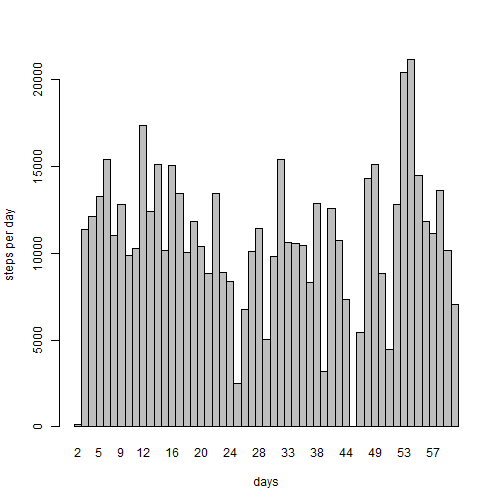
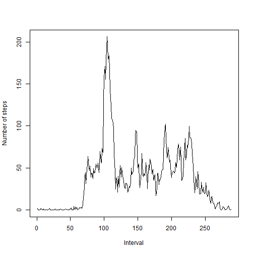
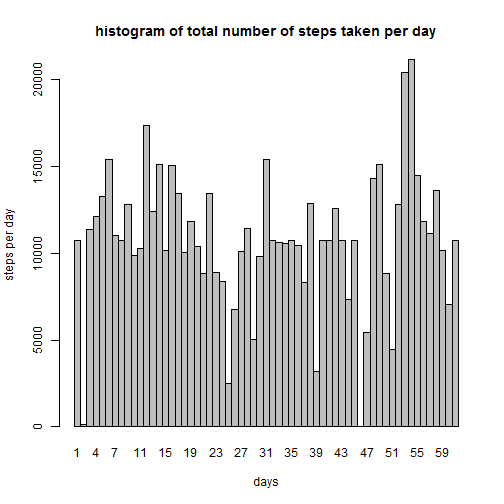
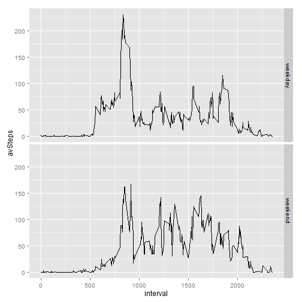

# Reproducible Research Peer Programme Assessment1
### author: Balogun Stephen Taiye
### Date: 2015-08-16


```r
sessionInfo()
```

```
## R version 3.2.1 (2015-06-18)
## Platform: x86_64-w64-mingw32/x64 (64-bit)
## Running under: Windows 7 x64 (build 7601) Service Pack 1
## 
## locale:
## [1] LC_COLLATE=English_United States.1252 
## [2] LC_CTYPE=English_United States.1252   
## [3] LC_MONETARY=English_United States.1252
## [4] LC_NUMERIC=C                          
## [5] LC_TIME=English_United States.1252    
## 
## attached base packages:
## [1] stats     graphics  grDevices utils     datasets  methods   base     
## 
## other attached packages:
## [1] knitr_1.10.5  mgcv_1.8-7    nlme_3.1-121  ggplot2_1.0.1 dplyr_0.4.2  
## 
## loaded via a namespace (and not attached):
##  [1] Rcpp_0.12.0      magrittr_1.5     MASS_7.3-43      munsell_0.4.2   
##  [5] colorspace_1.2-6 lattice_0.20-33  R6_2.1.0         highr_0.5       
##  [9] stringr_1.0.0    plyr_1.8.3       tools_3.2.1      parallel_3.2.1  
## [13] grid_3.2.1       gtable_0.1.2     DBI_0.3.1        htmltools_0.2.6 
## [17] lazyeval_0.1.10  assertthat_0.1   digest_0.6.8     Matrix_1.2-2    
## [21] formatR_1.2      reshape2_1.4.1   evaluate_0.7.2   rmarkdown_0.7   
## [25] labeling_0.3     stringi_0.5-5    scales_0.2.5     proto_0.3-10
```
Since the assigment require us to always have `echo` set to `TRUE`, i will set this to the global option so i will not have to do this during each plot  


```r
library(knitr)
opts_chunk$set(echo = TRUE, warning = FALSE, message = FALSE)
```
Now that i have done that, i will read-in my datasets using `read.csv()`

```r
activity <- read.csv("./activity.csv") ## reads in the dataframe
```
Nex, i subset the data to remove all the NAs for this inital analysis

```r
activitySub <- subset(activity, steps != "NA")
```
## What is mean total number of steps taken per day?

first, i will group the data by dates, the add up the steps for each day
using the `dplyr` package

```r
library(dplyr)

activitySumm <- activitySub %>%
                group_by(date) %>%
                summarise("stepsPerDay" = sum(steps))
```

#### next I make the histogram of the total number of steps per day using base plotting


```r
with(activitySumm, {
                barplot(stepsPerDay, space = 0, names.arg = as.integer(date))
                title(ylab = "steps per day", xlab = "days")
})
```

 
#### mean of total number of steps


```r
meanSteps <- activitySub %>% 
             group_by(date) %>%
             summarise("avStepPerDay" = mean(steps))
print(meanSteps)
```

```
## Source: local data frame [53 x 2]
## 
##          date avStepPerDay
## 1  2012-10-02      0.43750
## 2  2012-10-03     39.41667
## 3  2012-10-04     42.06944
## 4  2012-10-05     46.15972
## 5  2012-10-06     53.54167
## 6  2012-10-07     38.24653
## 7  2012-10-09     44.48264
## 8  2012-10-10     34.37500
## 9  2012-10-11     35.77778
## 10 2012-10-12     60.35417
## ..        ...          ...
```
#### median of total number of steps


```r
medianSteps <- activitySub %>% 
             group_by(date) %>%
             summarise("medianStep" = median(steps))
print(medianSteps)
```

```
## Source: local data frame [53 x 2]
## 
##          date medianStep
## 1  2012-10-02          0
## 2  2012-10-03          0
## 3  2012-10-04          0
## 4  2012-10-05          0
## 5  2012-10-06          0
## 6  2012-10-07          0
## 7  2012-10-09          0
## 8  2012-10-10          0
## 9  2012-10-11          0
## 10 2012-10-12          0
## ..        ...        ...
```

## What is the average daily activity pattern?

to make a time series plot of the average number of steps taken, averaged across all days,  first i will group the **activity** by `interval`, then find the average of steps for each `interval`

```r
activityByInterv <- sapply(split(activitySub$steps, activitySub$interval), mean)
```
next i plot the `interval` against the `averageSteps`

```r
plot(activityByInterv, type = "l", xlab = "Interval", 
     ylab = "Number of steps")
```

 
#### Which 5-minute interval, on average across all the days in the dataset, contains the maximum number of steps?  


```r
names(activityByInterv)[activityByInterv == max(activityByInterv)]
```

```
## [1] "835"
```

## Imputing missing values

#### the formular below calculates the total number of missing values in the datasets


```r
missingValues <- sum(is.na(activity$steps))
print(missingValues)
```

```
## [1] 2304
```

I will be substituting the missing values in the inital datasets with the average number of steps of their respective intervals. I will be naming the new datasets `activity2`


```r
activity2 <- activity
for (i in 1:nrow(activity2)) {
    if (is.na(activity2[i, "steps"])) {
        interval = as.character(activity2[i, "interval"])
        activity2[i, "steps"] = activityByInterv[interval]
    }
}           
```
#### Make a histogram of the total number of steps taken each day

first i summarise the `activity` after grouping it by date

```r
activitySum2 <- activity2 %>%
                group_by(date) %>%
                summarise("stepsPerDay" = sum(steps))
```
next i will be making the histogram of stepsPerDay for `activity2`

```r
with(activitySum2, {
                barplot(stepsPerDay, space = 0, names.arg = as.integer(date))
                title(main = "histogram of total number of steps taken per day", 
                      ylab = "steps per day", xlab = "days")
})
```

 
#### calculate the mean of the total number of steps taken per day

now, i will find the mean and the median of `activity2`

```r
meanSteps2 <- activity2 %>%
             group_by(date) %>%
             summarise("avStepPerDay" = mean(steps))
print(meanSteps2)
```

```
## Source: local data frame [61 x 2]
## 
##          date avStepPerDay
## 1  2012-10-01     37.38260
## 2  2012-10-02      0.43750
## 3  2012-10-03     39.41667
## 4  2012-10-04     42.06944
## 5  2012-10-05     46.15972
## 6  2012-10-06     53.54167
## 7  2012-10-07     38.24653
## 8  2012-10-08     37.38260
## 9  2012-10-09     44.48264
## 10 2012-10-10     34.37500
## ..        ...          ...
```
#### calculate the median of total number of steps taken per day


```r
medianSteps2 <- activity2 %>% 
             group_by(date) %>%
             summarise("medianStep" = median(steps))
print(medianSteps2)
```

```
## Source: local data frame [61 x 2]
## 
##          date medianStep
## 1  2012-10-01   34.11321
## 2  2012-10-02    0.00000
## 3  2012-10-03    0.00000
## 4  2012-10-04    0.00000
## 5  2012-10-05    0.00000
## 6  2012-10-06    0.00000
## 7  2012-10-07    0.00000
## 8  2012-10-08   34.11321
## 9  2012-10-09    0.00000
## 10 2012-10-10    0.00000
## ..        ...        ...
```
## What is the impact of imputing missing data on the estimates of the total daily number of steps?

The impact of imputing missing values:

* The mean of total number of steps per day does not differ the from the estimate   from the first datasets.

* The median of total number of steps per day changes and is no longer an          integers.

* Replacing missing values generally increases the total daily number of steps. 

## Are there differences in activity patterns between weekdays and weekends?

first i create a new factor variable with 2 levels "weekdays" and "weekend"

```r
activity2$weekdays <- weekdays(as.Date(activity2$date, format = "%Y-%m-%d"))

activity2$weekdays = factor(ifelse(activity2$weekdays == "Sunday" | activity2$weekdays == "Saturday", "weekend", "weekday"), levels = c("weekday", "weekend"))
```
next, i make a panel plot of the data above using the `ggplot2` plotting system

```r
 library(ggplot2)
 activity2Summ <- activity2 %>% group_by(weekdays, interval) %>% summarise(avSteps = mean(steps))
qplot(x = interval, y = avSteps, data = activity2Summ, geom = "line", facets = weekdays ~ .)
```

 
